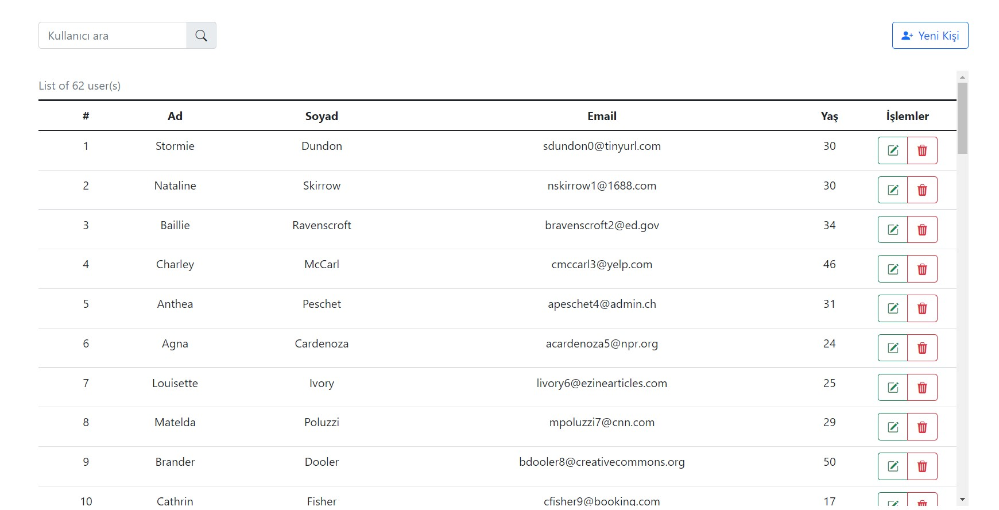
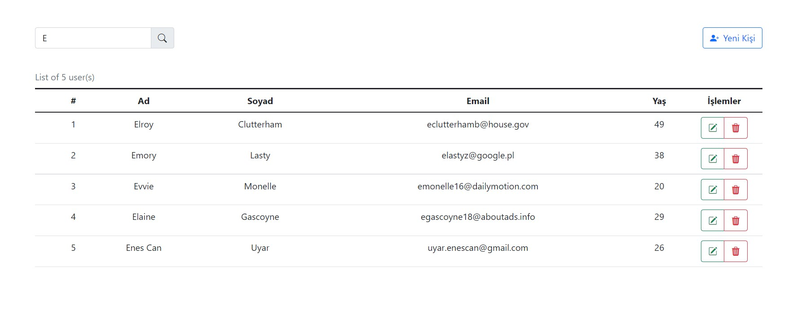
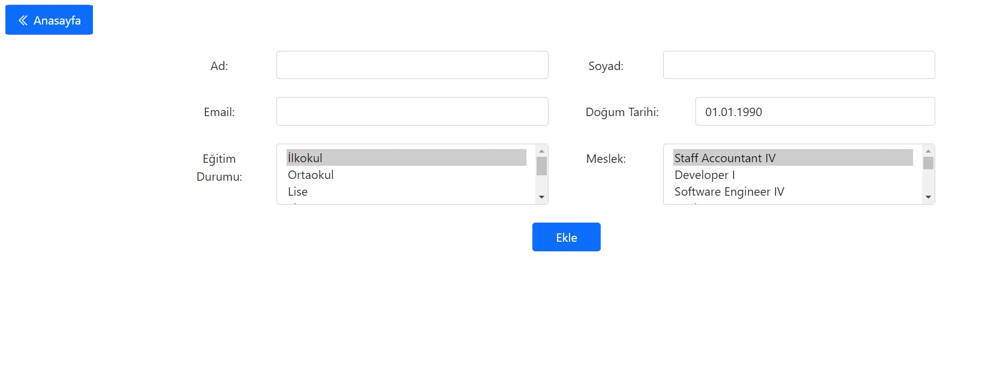
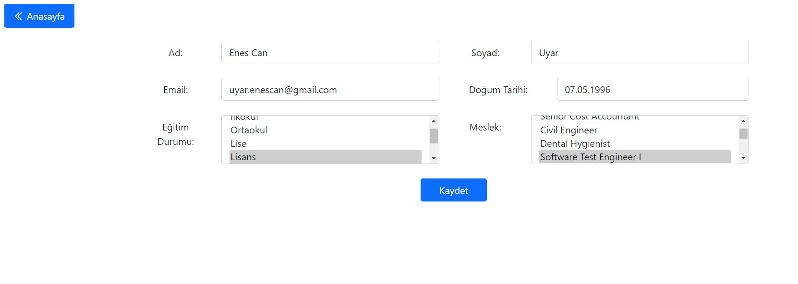

# People Project

This project consist of a Web Api project as a backend and a React project as a frontend. It uses MSSQL as database. You can find a script file to create the database with mock data. I didn't use lots of css for simplicity.

"people-api" project is built by using `Repository Pattern + Unit of Work` on the `.Net Core 5.0.12`. It uses [AutoMapper](https://github.com/AutoMapper/AutoMapper),  [FluentValidation](https://github.com/FluentValidation/FluentValidation).

"people-app" project is using [DatePicker](https://github.com/Hacker0x01/react-datepicker), [Alertify.js](https://github.com/alertifyjs), and other `node-modules`.

## How To Start

- Create the database with the given script
- If you want to set a custom port for the api, go to the [appsettings.json](https://github.com/ecuyar/PeopleProject/blob/master/people-api/people-api/appsettings.json) and set the port vs.
- If you set custom port, go to the people-app project and in the [.env](https://github.com/ecuyar/PeopleProject/blob/master/people-app/.env) folder, change the server address.
- Open the "people-api" project with Visual Studio and build it.
- Go the bin/debug folder and run the server.
- Go to the "people-app" project and start it with `npm start`.

## App Images

### Main Page
Here you can see all people on the system. You can perform add new person, edit, delete operations for every user.

### Filter
You can filter names with search bar on the left upper corner.

### Add New Person
You can add new person on this page. It has form validation and all fields are required.

### Edit Person
You can edit person on this page.

